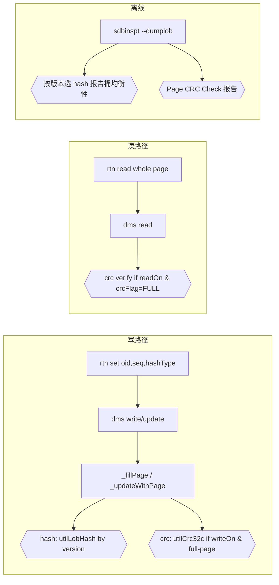
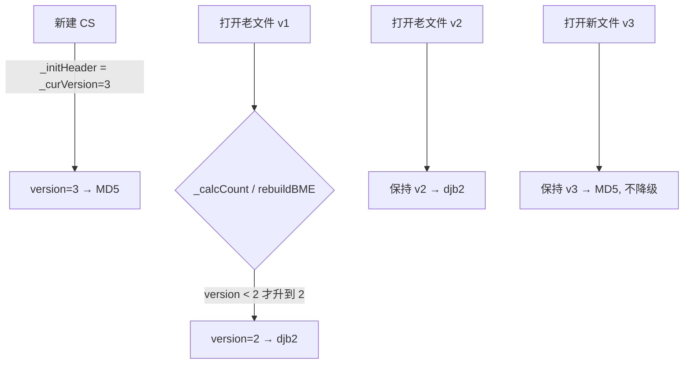
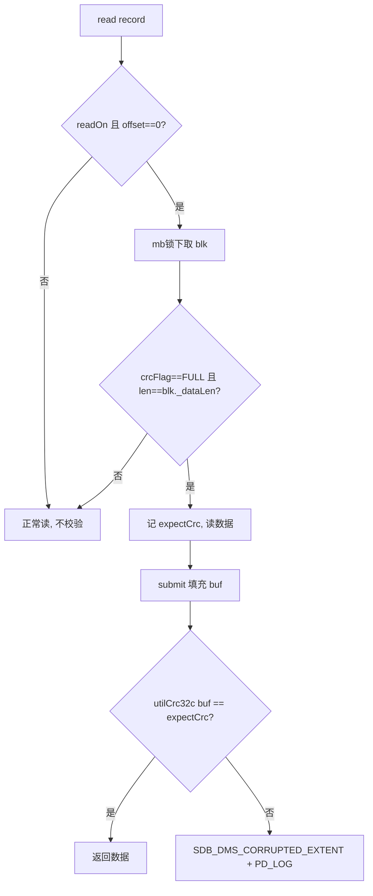

# LOB 桶均衡性(hash)与数据页 CRC 校验 优化设计

> 适用范围: 数据节点 LOB 存储(`.lobm` / `.lobd`)。
> 目标:
> - 问题 1:改进 LOB 桶 hash 算法,消除桶极不均衡(inspect 报告 Variance / Max Depth 偏大)。
> - 问题 2:为 LOB 数据页(lobd)增加 CRC 校验,检测数据有效性。
> 开发约束:编译零告警;最小改动;放置在合理模块、遵循既有命名与编码风格;测试用例写入 `testcase_new`,`./updateAll.sh` 一键编译运行。

---

## 0. 架构总览

### 0.1 lobm / lobd 文件结构与对应关系

```
            lobm ( .lobm 元数据/桶 )                       lobd ( .lobd 数据 )
   +------------------------------------+          +----------------------------+
   | Header(64K)  _version / _pageSize  |          | Header(64K)                |
   +------------------------------------+          +----------------------------+
   | SME  空间位图(free/allocated)       |          | data page 0 (piece bytes)  |
   +------------------------------------+          | data page 1                |
   | BME  INT32 _buckets[16M] 桶链头      |---+      | ...                        |
   +------------------------------------+   |      | data page N                |
   | blk#0  _dmsLobDataMapBlk (64B)      |   |      +----------------------------+
   | blk#1  {oid,seq,dataLen,            |   |          ^  page#N 一一对应 blk#N
   | blk#N   prev/next, status,          |<--+----------+
   |         crc,crcFlag}                |   桶链: _prevPageInBucket/_nextPageInBucket
   +------------------------------------+
```

- **分片**:一个 LOB 按 lobd 页大小切成 piece;`sequence=0` 为 meta 页(合并首段数据),`1,2,…` 为后续整页。
- **写桶**:`bucket = hash(oid,seq) & (2^24-1)`;`BME[bucket]` 指向一条 blk 双向链,`_find/_push2Bucket` 顺链操作。
- **写页**:数据写入 lobd 第 N 页;`blk#N` 记录该页的 oid/seq/长度/链指针(本设计再加 crc)。

### 0.2 本设计新增/改动点全景



### 0.3 改动模块与文件一览

| 模块 | 文件 | 改动摘要 |
|---|---|---|
| util | `include/utilLobID.hpp`,`util/utilLobID.cpp` | 新增 `utilLobHash`(djb2/md5)、`utilCrc32c`(CRC32C) |
| dms | `include/dmsLobDef.hpp` | 版本常量;`set()` 传 hashType;blk 增 `_crc/_crcFlag`(64B) |
| dms | `include/dmsStorageLob.hpp` | `_hashVersion` 缓存;`hashType()`/`_calcHash`;`getBucketID` 加参 |
| dms | `dms/dmsStorageLob.cpp` | 版本缓存/迁移;hash 统一;CRC 生成(写)/校验(读) |
| dms | `include/dmsDump.hpp`,`dms/dmsDump.cpp` | `dumpDmsLobDataMapBlk`/`getBucketID` 传 hashType |
| rtn | `rtn/rtnLob.cpp` 等 4 文件 | `set()` 调用点传 `su->lob()->hashType()` |
| pmd | `misc/autogen/optlist.xml`,`pmd/pmdOptionsMgr.*` | 节点参数 `lobdatachecksum`(mask,在线生效) |
| tools | `tools/sdbinspt.cpp` | 按版本选 hash;Page CRC Check 报告 |
| test | `testcase_new/story/js/lob/lob_*_6000x.js` | 3 个功能用例 |

---

## 1. 现状回顾(与本设计相关部分)

- 每个集合 LOB = `.lobm`(元数据/桶) + `.lobd`(数据),由 `_dmsStorageLob` 管理
  ([SequoiaDB/engine/include/dmsStorageLob.hpp](SequoiaDB/engine/include/dmsStorageLob.hpp))。
- `.lobm` 数据区每页是 64B 的 `_dmsLobDataMapBlk`,描述对应 lobd 页并组成桶链
  ([dmsLobDef.hpp:265](SequoiaDB/engine/include/dmsLobDef.hpp))。
- 桶 hash = djb2 `ossHash(oid[12], sequence[4])`(宏 `DMS_LOB_GET_HASH_FROM_BLK`,
  [dmsStorageLob.cpp:61](SequoiaDB/engine/dms/dmsStorageLob.cpp));桶号 = `hash & (2^24-1)`
  (`_getBucket`,[dmsStorageLob.hpp:273](SequoiaDB/engine/include/dmsStorageLob.hpp))。
- `record._hash` 在 rtn 层 `_dmsLobRecord::set()` 计算([dmsLobDef.hpp:118](SequoiaDB/engine/include/dmsLobDef.hpp));
  dms 内部(`_fillPage/_find/_push2Bucket/rebuildBME`)用宏从 blk 重算,二者必须一致。
- **备机回放不使用日志里的 hash**:DPS 日志虽含 `DPS_LOG_LOB_HASH`,但 `clsReplayer` 解析后该值被丢弃
  ([clsReplayer.cpp:456](SequoiaDB/engine/cls/clsReplayer.cpp)),实际调用 `rtnWriteLob(...)`
  ([clsReplayer.cpp:1578](SequoiaDB/engine/cls/clsReplayer.cpp)) → 内部 `record.set()` **本机重算**。
  故主备各自本机计算,依赖的是"主备 lobm 文件版本一致",与 DPS hash 无关。
- 注意:`clsReplayer::_calcLobBucketID` 里的 `BSON_HASHER::hash(oid+seq)`
  ([clsReplayer.cpp:514](SequoiaDB/engine/cls/clsReplayer.cpp))是**回放并行分发桶**,与存储桶无关,**不得改动**。
- coord/catalog 侧已有 `clsPartition(oid, sequence, partitionBit)`,对 **oid[12]+sequence[4] 做 MD5**
  ([clsCatalogAgent.cpp:4982](SequoiaDB/engine/cls/clsCatalogAgent.cpp));`sizeof(bson::OID)==12`,输入与 dms 桶 hash 完全一致。
- inspect(`sdbinspt --dumplob`)遍历所有页统计桶深度,输出均衡性报告(Min/Max/Average Depth、
  Variance、深度直方图,[sdbinspt.cpp:6024](SequoiaDB/engine/tools/sdbinspt.cpp))。
- 头部字段有对象缓存范式:`_pageSize/_lobPageSize` 为「cache, not use header」成员,open 时从
  mmap 头拷入([dmsStorageBase.hpp:733](SequoiaDB/engine/include/dmsStorageBase.hpp)、[dmsStorageBase.cpp:1829](SequoiaDB/engine/dms/dmsStorageBase.cpp))。
- 节点配置 mask 字符串范式:`--auditmask` / `--ftmask`,`rdxString(..., PMD_CFG_CHANGE_RUN, dft)`
  运行时可改([pmdOptionsMgr.cpp:2193](SequoiaDB/engine/pmd/pmdOptionsMgr.cpp))。

---

## 2. 问题 1:LOB 桶 hash 优化

### 2.1 根因
桶号取 djb2 结果的低 24 位,而 djb2 低位雪崩性差;LOB OID 高度结构化(时间戳近常量、oddCheck 低熵、
id 常量、serial 自增),sequence 为小整数 → hash 落点呈固定步长等差聚集 → 少数桶链极长、多数桶空,
表现为 inspect Variance / Max Depth 偏大。桶链是遍历式 find/insert/remove,链长直接拖慢 LOB 读写。

### 2.2 关键事实(决定改造代价低)
blk **不持久化 hash**,桶归属由 hash 函数运行时决定。改 hash 不需迁移任何存量 hash,只需保证
**同一文件始终用同一算法**。故:老文件用老算法、新文件用新算法,以 **lobm 文件版本号**区分。

### 2.3 设计

**(a) 版本区分 —— 复用已有 `_version`,不动通用头**
- `_dmsStorageUnitHeader` 为三种 SU 共用,不新增字段;复用已有 `_version`。
- lobm 版本升级:`DMS_LOB_VERSION_3 = 3`;`DMS_LOB_CUR_VERSION = 3`;`_curVersion()` 返回 3。
- 新算法门控:`version >= 3` 用 MD5,`version <= 2` 用 djb2。
- 旧二进制 `_checkVersion`(`_version > _curVersion()` 报错)天然拒绝打开 v3 文件,作为安全边界。

**(b) 新算法 —— 复用 coord 的 MD5,抽公共函数**
- 新增公共函数(util 模块已依赖 bson md5):
  ```cpp
  // 声明: SequoiaDB/engine/include/utilLobID.hpp
  // 实现: SequoiaDB/engine/util/utilLobID.cpp
  enum UTIL_LOB_HASH_TYPE { UTIL_LOB_HASH_DJB2 = 0, UTIL_LOB_HASH_MD5 } ;
  UINT32 utilLobHash( const BYTE *oid, UINT32 sequence,
                      UTIL_LOB_HASH_TYPE hashType ) ;
  ```
  用 **enum 而非版本号**入参,避免 util 依赖 dms 的版本常量;由 dms 的 `hashType()` 做映射。

  **版本 → 算法 → 桶号 映射表**

  | lobm `_version` | `hashType()` | 算法 | 桶号 |
  |---|---|---|---|
  | ≤ 2(老文件) | `UTIL_LOB_HASH_DJB2` | djb2 `ossHash(oid,12,&seq,4)` | `hash & (2^24-1)` |
  | = 3(新文件) | `UTIL_LOB_HASH_MD5` | MD5(oid12‖seq4) 取 digest[1..4] 拼 32 位(同 `clsPartition`) | `hash & (2^24-1)` |

- 桶号 `_getBucket` 不改(MD5 各 bit 均匀,取低位即可)。
- 成本:piece 为页大小(KB 级),对 16 字节做一次 MD5 相对数据 IO 可忽略。
- `clsPartition` 本期**不改**(避免影响分区路由);其算法与 `utilLobHash(MD5)` 等价,概念已统一。

**版本赋值/迁移(关键:不误标、不降级)**


> 迁移路径只把 `v1→v2`(同为 djb2),**绝不**把老文件升到 v3,也**绝不**把 v3 降级,保证桶算法与既有桶一致。

**(c) 版本对象缓存(仿 `_pageSize`)**
- `_dmsStorageLob` 新增成员 `UINT32 _hashVersion ;`(cache, not use header)。
- 填充:`_dmsStorageLob::_onOpened()`([dmsStorageLob.cpp:2159](SequoiaDB/engine/dms/dmsStorageLob.cpp))
  中 `_hashVersion = getHeader()->_version ;`。
- 刷新:凡改写 `_dmsHeader->_version` 的迁移路径同步更新缓存 ——
  `rebuildBME`([:2795](SequoiaDB/engine/dms/dmsStorageLob.cpp))、`_calcCount`([:2674](SequoiaDB/engine/dms/dmsStorageLob.cpp))。
- hash 热路径只读 `_hashVersion` 成员,**不访问 mmap 头**。

**(d) `set()` 传版本,内外统一**
- `_dmsLobRecord::set(oid, sequence, offset, dataLen, data, UINT32 hashVer)`:内部
  `_hash = utilLobHash(oid, sequence, hashVer)`。
- 调用处均持 su:`rtnWriteLob2`([rtnLob.cpp:975](SequoiaDB/engine/rtn/rtnLob.cpp))、fetcher
  ([rtnLobFetcher.cpp:213](SequoiaDB/engine/rtn/rtnLobFetcher.cpp))等传
  `su->lob()->hashVersion()`(新增内联 getter 返回 `_hashVersion`)。
- dms 内部宏 `DMS_LOB_GET_HASH_FROM_BLK` 改为成员 `_calcHash(oid,seq)`(读 `_hashVersion`),
  替换 `_fillPage/_find/_push2Bucket/rebuildBME` 及 DEBUG 断言处的所有重算点。
- 静态 `getBucketID(blk)`([:127](SequoiaDB/engine/dms/dmsStorageLob.cpp))增 `hashVer` 入参,dump/inspect
  由读到的头版本传入。

**(e) 备机一致性(修正:回放不用 DPS hash)**
- 备机回放经 `rtnWriteLob → record.set(..., su->lob()->hashVersion())` **本机重算 hash**,
  不使用 DPS 日志里的 hash 值。因此**无需改动 DPS 模块**(`dpsOp2Record` / 日志 `_hash` 字段保持不变,
  仅为兼容/日志用途,继续被回放忽略)。
- 一致性充要条件:**主备 lobm 文件版本一致**。v3 文件只由新版本二进制创建/打开,建议
  **v3 门控在集群升级提交后**创建的 CS 才启用,升级过程中新建 CS 仍用 v2,避免主备版本(算法)不一致。
- `clsReplayer::_calcLobBucketID` 的并行分发桶 hash 与存储桶无关,**不改动**。

**(f) inspect**
- `inspectBME` 依据读到的头版本选择 `utilLobHash` 版本重算桶号,报告即反映新分布(改善验证工具)。

### 2.4 存量重平衡(可选,不在本期强制)
`rebuildBME` 已遍历全部页按 hash 重建桶链。可选提供 repair 动作:改写头版本→3 后用新算法
`rebuildBME` 对老热点 CS 一次性重平衡。默认不动老 CS(满足"老 CS 用老算法")。

---

## 3. 问题 2:LOB 数据页 CRC 校验

### 3.1 存储位置
存进 lobm 的 `_dmsLobDataMapBlk._pad2[24]`(当前纯 padding):
```cpp
// 保持 struct 64B 不变
UINT32 _crc ;       // lobd 数据页校验值(覆盖 [0, dataLen))
UINT8  _crcFlag ;   // 0=NONE(无有效CRC) 1=FULL
CHAR   _pad2[ 24 - sizeof(UINT32) - sizeof(UINT8) ] ; // = _pad2[19]
```
优点:校验值与数据分文件存放(检出 lobd 位翻转/半写);不改 lobd 页布局、与页大小无关;零迁移
(旧页天然 `_crcFlag=0`);写入点天然在 `_fillPage`(现正好 `ossMemset(_pad2,0)`,[dmsStorageLob.cpp:1440](SequoiaDB/engine/dms/dmsStorageLob.cpp))。
inspect `inspectDmsLobDataMapBlk` 仅校验 `_status/_dataLen`,不校验 pad2,无冲突。

CRC 算法:CRC32C(优先硬件指令,退表法)或直接 `thirdparty/boost/boost/crc.hpp`。新增
`utilCrc32c(const void*, UINT32)`(util 模块)。

### 3.2 只对"全写页"生成(无 RMW)
用独立 `_crcFlag`(不复用 `_newFlag`,后者语义是"改过没"):
- `_fillPage` 新页整段写、或 `_updateWithPage` 中 `offset==0 && dataLen>=旧 blkLen`(整页覆盖/从 0 增长)
  → 手里有整页有效内容 → 算 CRC 覆盖 `[0,dataLen)`,`_crcFlag=FULL`。
- 真正子区间原地更新(offset>0 且不覆盖)→ `_crcFlag=NONE`,读侧跳过。
- **写路径零额外 IO**。
- `rebuildBME` **不读 lobd、不校验 CRC**(仅重建桶链),符合现状。

**写路径 CRC 生成决策表**(`writeOn = lobChecksumWriteOn()`)

| 场景 | writeOn | offset | 覆盖范围 | 结果 |
|---|---|---|---|---|
| 新页整段写 `_fillPage` | 是 | 0 | [0,dataLen) 全在 record._data | `setCrc`,`_crcFlag=FULL` |
| 更新-整页覆盖 `_updateWithPage` | 是 | 0 | `dataLen ≥ orgBlkLen` | `setCrc`,`_crcFlag=FULL` |
| 更新-子区间 `_updateWithPage` | 任意 | >0 或不覆盖 | 部分 | `clearCrc`,`_crcFlag=NONE`(防陈旧) |
| 关闭 | 否 | — | — | 新页 NONE;更新一律 `clearCrc` |

> `_crcFlag` 状态机:`NONE --整页写(writeOn)--> FULL`;`FULL --任意部分更新--> NONE`。永不残留陈旧 CRC。

**读路径 CRC 校验流程**(`readOn = lobChecksumReadOn()`,校验点在 `read()`)



### 3.3 开关:节点配置参数(mask,经 optlist.xml 生成)
仿 `--auditmask`,新增运行时可改参数。**参数定义在 `misc/autogen/optlist.xml` 新增 `<opt>`**
(宏 `PMD_OPTION_LOB_DATA_CHECKSUM` 由构建自动生成,**不手写宏**),格式参照 `PMD_OPTION_AUDIT_MASK`
([optlist.xml:415](misc/autogen/optlist.xml)):
```xml
<opt>
  <name>PMD_OPTION_LOB_DATA_CHECKSUM</name>
  <long>lobdatachecksum</long>
  <description><en>LOB data page checksum mask, values: write,read; use '|' to join; default: write</en>
                <cn>LOB 数据页校验掩码,取值:write,read,'|'连接;默认 write</cn></description>
  <reloadable><en>Take effect immediately</en><cn>在线生效</cn></reloadable>
  <default>write</default>
  <typeofweb>str</typeofweb>
</opt>
```
- 值 mask:`"write"`(默认)/`"read"`/`"write|read"`/`""`。`write` 位=全写页生成 CRC;`read` 位=整页读时校验。
- pmdOptionsMgr 侧:用生成的宏 `rdxString(pEX, PMD_OPTION_LOB_DATA_CHECKSUM, _lobChecksumMaskStr,
  sizeof(_lobChecksumMaskStr), FALSE, PMD_CFG_CHANGE_RUN, "write")`([pmdOptionsMgr.cpp:2193](SequoiaDB/engine/pmd/pmdOptionsMgr.cpp) 附近),
  解析成 `UINT32 _lobChecksumMask`,提供 `lobChecksumWriteOn()/lobChecksumReadOn()`。
- 说明(如实):节点级 ⇒ per-node,主备 CRC 存在性可能不同;但每页有 `_crcFlag`,校验仅在 `FULL` 时进行,
  天然跳过缺失页;CRC 定位为本地数据有效性体检,不要求跨副本一致。不区分集合(相对集合属性的取舍)。

### 3.4 校验点
> 实现修正:`readPage`([dmsStorageLob.cpp](SequoiaDB/engine/dms/dmsStorageLob.cpp))只读 lobm blk、不读 lobd 数据,
> 无法在其中校验整页 crc。真正的整页数据读发生在 `read()`(fetcher 以 offset=0、len=整页调用),
> 故校验点落在 **`read()`**:当 `read` 位开启且为整页读(offset==0 且 len==页数据长)且 blk `_crcFlag==FULL`
> 时,在 mb 锁下捕获 `expectCrc`,submit 填充 buf 后 `utilCrc32c` 比对,不符返回错误并 PD_LOG 定位;
> 子区间读不校验。inspect 侧在 `inspectCollectionLob` 逐页读 lobd 校验并输出 "Page CRC Check"。
>
> 错误码:**复用现有 `SDB_DMS_CORRUPTED_EXTENT`**("DMS extent is corrupted",lob 数据页即一个 dms extent),
> 避免向 `rclist.xml` 追加新码带来的跨分支重编号风险。如需专用码,可按 `rclist.xml` 末尾追加 +
> `SDB_ERROR_RESERVED_NNN` 对齐的机制新增(本期未做)。
- inspect:CRC 校验**由参数 `--crccheck`(短 `-C`)控制,默认关闭**。因校验需逐页回读 lobd 数据并重算 CRC,
  比常规 inspect 慢很多,故做成显式开启:`sdbdmsdump -a inspect -b true -C true`。
  - 开启时:遍历 `_crcFlag==FULL` 的页校验,报告 "Page CRC Check : Pass/Fail/NoCRC";每个失配页额外打印
    `expect/actual/dataLen` 明细,便于区分"数据损坏"与"CRC 字段损坏"。
  - 关闭时(默认):报告 "Page CRC Check : skipped (use --crccheck true)",不产生额外 IO。
  与桶均衡性报告并列输出([sdbinspt.cpp](SequoiaDB/engine/tools/sdbinspt.cpp) inspectBME/inspect 数据页处)。
- dump:`dumpDmsLobDataMapBlk`([dmsDump.cpp](SequoiaDB/engine/dms/dmsDump.cpp))在页元信息中**输出 `CRC Flag` 与
  `CRC` 值**(FULL 时),便于人工核对;dump 本身不做校验(职责是导出内容)。

### 3.5 崩溃一致性
blk(含 crc)与 lobd 数据在同一写操作内、均被 DPS 覆盖;崩溃后按 DPS 回放同时重建 blk 与数据页,
CRC 与数据保持一致。

---

## 4. 兼容性总表

| 场景 | hash | CRC |
|---|---|---|
| 老文件(version<=2) | djb2(不变) | `_crcFlag=NONE`,不校验 |
| 新文件(version=3) | MD5 | 按节点 mask 生成/校验,全写页 FULL |
| 混合版本集群 | v3 门控在升级提交后创建的 CS | 无跨副本一致性要求 |
| 备机回放 | 经 rtnWriteLob→set() **本机重算**(不用 DPS hash),依赖主备文件版本一致 | blk 随回放重建 |

---

## 5. 开发约束落实
- **编译零告警**:新增函数/字段严格类型匹配;mask 解析、CRC 计算避免隐式截断;`_pad2` 重排后
  `SDB_ASSERT(64==sizeof(_dmsLobDataMapBlk))` 保持通过。
- **最小改动 & 模块归位**:
  - 公共 hash/crc → `util`(`utilLobID.*` / 新增 `utilCrc32c`),与既有 `utilBsonHash` 同级风格。
  - 版本缓存/`_calcHash`/CRC 生成校验 → `dms`(`dmsStorageLob.*` / `dmsLobDef.hpp`)。
  - 节点参数 → `misc/autogen/optlist.xml`(生成宏)+ `pmd/pmdOptionsMgr.*`(成员/解析/getter)。
  - 错误码 → `misc/autogen/rclist.xml`(注意跨分支 reserved 填充对齐)。
  - inspect → `tools/sdbinspt.cpp`。
  - **不改 `dps` 模块**(回放不用日志 hash)。
- **命名风格**:沿用 `_camelCase` 成员、`utilXxx` / `PMD_OPTION_XXX` / `DMS_LOB_XXX` 宏、
  `rc/goto done/error` 错误处理范式。

---

## 6. 测试计划(testcase_new,`./updateAll.sh` 一键编译运行)
新增用例放 `testcase_new/story/js/lob/`(参照现有 `lob_*.js` 结构,`main(test)` + `testConf`):
1. `lob_hashBalance_<id>.js`:大量写入 LOB 后,校验新 CS 的桶均衡性显著优于旧算法
   (通过 `sdbinspt --dumplob` 输出解析 Variance/Max Depth,或 snapshot),并验证读写正确性。
2. `lob_hashCompat_<id>.js`:老版本文件仍用旧算法可正常读写(升级兼容);新建 CS 走新算法。
3. `lob_pageCrc_write_<id>.js`:`lobdatachecksum=write` 下写入后,inspect 报告 CRC 全部通过。
4. `lob_pageCrc_read_<id>.js`:`lobdatachecksum=write|read` 下正常读通过;构造损坏页(工具/dump 定位)
   验证 read 校验能报错。
5. `lob_pageCrc_config_<id>.js`:运行时 `updateConf` 修改 mask,write/read 位分别生效。
6. 复用/新增 inspect 断言:验证 "Page CRC Check" 统计段落存在且计数正确。

**已落地用例(seqDB-60001 ~ 60012)**:
- 正常路径:`lob_dataChecksum_readWrite_60001` / `lob_dataChecksum_configMask_60002` / `lob_hashMultiPiece_60003`。
- 功能边缘:`lob_dataChecksum_emptyTiny_60004`(空/极小)、`lob_dataChecksum_pageBoundary_60005`(整页±1)、
  `lob_dataChecksum_truncate_60006`(truncate 非页对齐)、`lob_dataChecksum_readNoCrc_60007`(read 校验读无 CRC 老数据不误报)、
  `lob_dataChecksum_invalidMask_60008`(非法掩码优雅降级)。
- 坏页检测(异常主场景):`lob_dataChecksum_corruptDetect_60009`(dd 篡改全副本 → getLob 报 `SDB_DMS_CORRUPTED_EXTENT`
  + `sdbdmsdump inspect -C true` 报 Fail≥1 及 expect/actual 明细)、`lob_dataChecksum_inspectHealthy_60010`(健康基线 Fail 0)。
- 非全写(RMW):`TestLobDataChecksumRMW60012.java`(java 用例,`lockAndSeek` 中途覆盖写 → 非全写页 NoCRC 不误报;
  JS 高层 API 无法构造此场景,故用 java 覆盖)。
- 公共 helper 见 `testcase_new/story/js/lob/commlib.js`:`lobGetGroupNodes`/`lobCorruptDataPage`/`lobInspectNode`/`lobParseCrcFail`。
- hash 版本升级兼容(老版本装 LOB → 升级 → 读写)后续**手工**验证。
> 每个用例分配 seqDB 编号,文件头注释按现有模板(@Description/@Author/...)。

---

## 7. 子任务拆分(见任务列表)
1. util:`utilLobHash` + `utilCrc32c`(含声明/实现/编译)。
2. dms 版本:`DMS_LOB_VERSION_3`、`_curVersion`、`_hashVersion` 缓存 + 填充/刷新。
3. dms hash:`_dmsLobRecord::set` 传版本、`_calcHash` 替换所有重算点、`getBucketID` 加参、`hashVersion()` getter。
4. rtn:各 `set()` 调用处传 `su->lob()->hashVersion()`。
5. dms CRC 存储:`_dmsLobDataMapBlk` 增 `_crc/_crcFlag` 并保持 64B。
6. pmd 参数:`lobdatachecksum` mask 参数(运行时可改)+ getter。
7. dms CRC 生成:`_fillPage`/全写 `_updateWithPage` 生成 CRC。
8. dms CRC 校验:`readPage` 按 read 位校验。
9. tools:inspect 按版本选 hash;新增 Page CRC Check 报告。
10. 测试:testcase_new 用例 6 项 + `./updateAll.sh` 跑通。
11. 编译零告警自检 + 文档定稿。

---

## 7.5 独立 Agent Review 结论(依据本设计文档)

由**独立 review agent** 对照本设计文档逐文件审查,结论:实现与设计一致,预期可零告警编译。发现并处理:

| 级别 | 问题 | 处理 |
|---|---|---|
| Major | `utilGetCrc32cTable` 用手写 bool 守卫非线程安全(并发首用可能读到半初始化表 → 误报损坏) | **已修**:改用带非平凡构造的局部 `static const` 结构体,C++11 保证一次性线程安全初始化 |
| Minor | `sdbinspt` CRC 读缓冲信任 `blk._dataLen ≤ 页大小`(inspect 面向可能损坏的文件,越界风险) | **已修**:增加 `blk._dataLen <= gLobdPageSize` 边界判断,超界跳过(该 blk 已由 inspectDmsLobDataMapBlk 标错) |
| Minor(设计已知) | `read()` 在锁下取 expectCrc、解锁后 submit 再比对,并发整页覆盖可能误报 | 保留(SHARED 锁 + LOB 写序列化下极少发生);已在 §3.4 注明 |
| Nit | `md5_append` 的 `size_t→int` 窄化 | 无害,与既有 `clsPartition` 同款写法,不产生新告警 |

Review 复核通过的要点(节选):结构体仍为 64B 且 `_crc` 4 字节对齐;`_crcFlag` 在构造/reset/`_fillPage` 均初始化,部分更新必清;生成区间 `[0,dataLen)` 与读校验区间一致;MD5 与 `clsPartition` 逐字节相同;迁移只 v1→v2、v3 不降级;所有 `set()/getBucketID/dumpDmsLobDataMapBlk` 调用点均已传 hashType;util 不依赖 dms、链接安全。

## 8. 风险
- 混合版本主备 hash 不一致 → v3 门控在升级提交后创建的 CS 才启用。
- `_pad2/_version` 复用:已核对 `reset()`/`isUndefined()`/inspect 均不依赖其值,安全。
- read 校验开销:默认只 `write`,read 按需/诊断开启;子区间小读不校验。
- CRC 算法一致性:统一 `utilCrc32c`,跨平台字节序一致。
